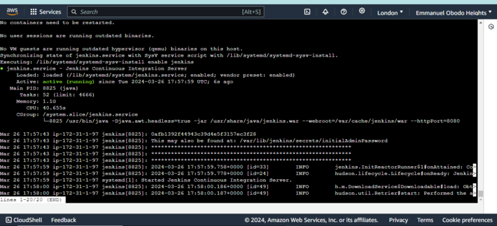
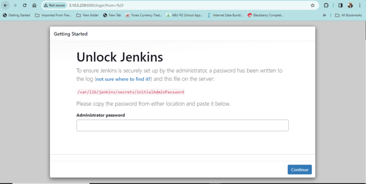
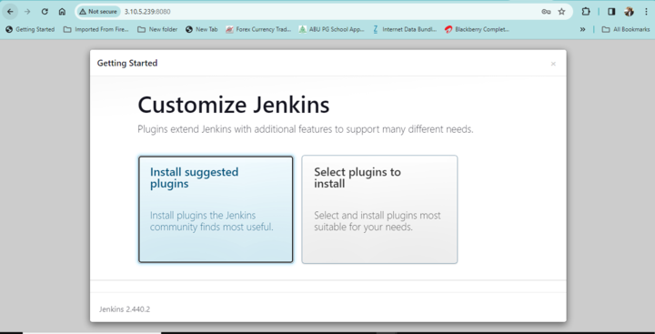
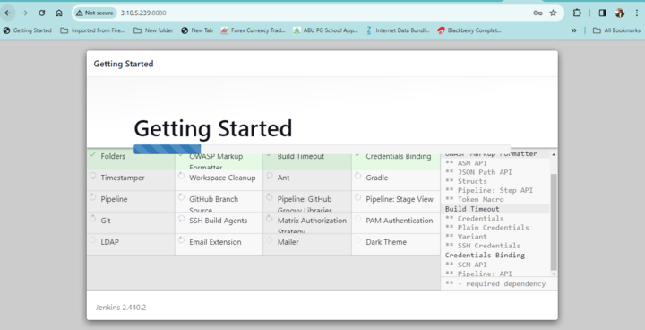
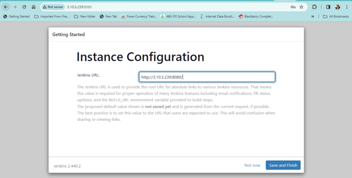
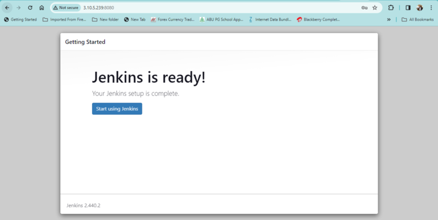
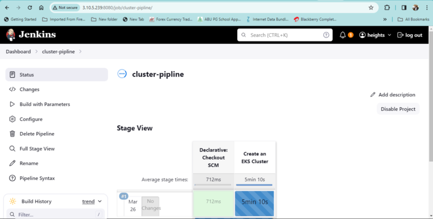
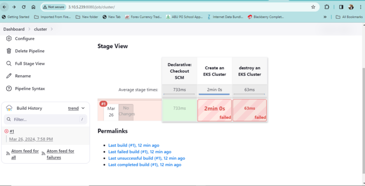

#hello
he.png>)llo

.png>)

.png>)

.png>)

.png>)

.png>)

 is a managed Kubernetes service that makes it easy for you to run Kubernetes on AWS and on-premises. Kubernetes is an open-source system for automating deployment, scaling, and management of containerized applications. This directory contains all the files required to manage the elastic kubernetes service on aws intance. png)

KUBERNETES DIRECTORY
A Kubernetes cluster is a set of nodes that run containerized applications. Containerizing applications packages an app with its dependences and some necessary services. They are more lightweight and flexible than virtual machines. In this way, Kubernetes clusters allow for applications to be more easily developed, moved and managed The kubernetes directory contains all files required to automate the provisioning of the sock shop through jenkins pipeline

EXPLAINING THE FILES.
Here I would like to explain some very important files and their operations with some very important rules.
(i) Installer.sh: The installer.sh. installs Jenkins and also start Jenkins in the ec2 instance on aws.

(ii) Cluster-Jenkinsfile =Deploys the Elastic Kubernetes Service (EKS) pipeline on aws.

(iii) Jenkinsfile = Deploys the Kubernetes Cluster (10 micro-services) pipeline on aws.

(iv) The ingress rule and the domain name explain, the Nginx-ingress rule helps us to create an internal load balancer, this internal load balancer takes every service in the EKS Cluster and route the traffic, using the ingress rule, the ingress rule help route that traffic to a specific sub-domain, so that we can access both grafana and sock shop on the browser with the domain name provided in the automation in my case “manifestationcloudservice.com.ng” in addition Prometheus is for monitoring and by default grafana is also installed once Prometheus is installed.

THE PROCESS OF RUNING THE ENTIRE PROJECT WITH AWS AND JENKINS PIPELINES IN PICTURES.
the process starts with Selecting a region. One of the most important steps is to select the desired AWS region.
creat an ec2 in aws with a vpc having an ingress rule allowing all traffic, port 22, port 443 and port 80 while also having an egress rule allowing all traffic on ipv4 and ipv6.

clone the repository from github basically to run the istaller.sh with its dependences using the following command (./installer.sh)